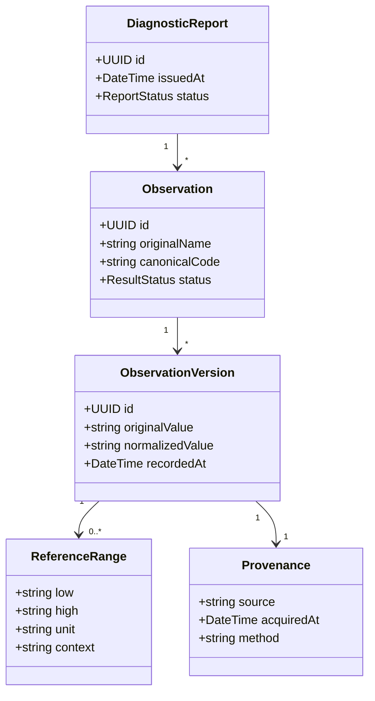

# Modelo de Diagnósticos

```mermaid
classDiagram
    class DiagnosticReport {
      +UUID id
      +DateTime issuedAt
      +ReportStatus status
    }

    class Observation {
      +UUID id
      +string originalName
      +string canonicalCode
      +ResultStatus status
    }

    class ObservationVersion {
      +UUID id
      +string originalValue
      +string normalizedValue
      +DateTime recordedAt
    }

    class ReferenceRange {
      +string low
      +string high
      +string unit
      +string context
    }

    class Provenance {
      +string source
      +DateTime acquiredAt
      +string method
    }

    DiagnosticReport "1" --> "*" Observation
    Observation "1" --> "*" ObservationVersion
    ObservationVersion "1" --> "0..*" ReferenceRange
    ObservationVersion "1" --> "1" Provenance
```
