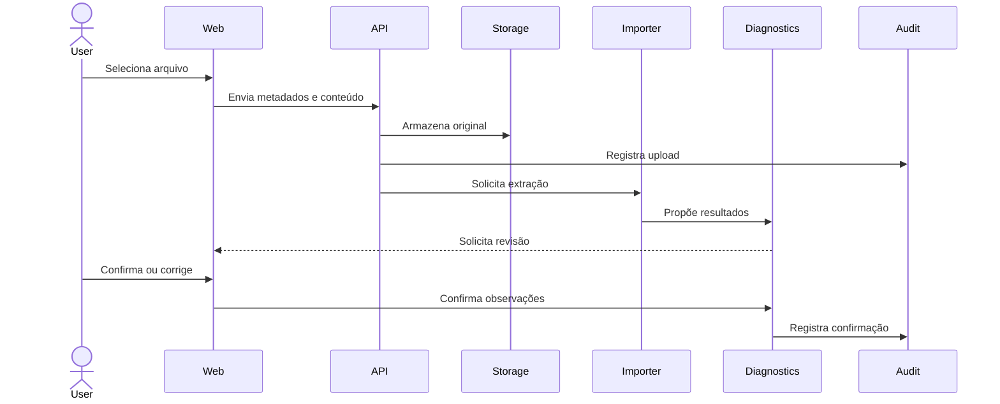

# Sequência de Importação

```mermaid
sequenceDiagram
    actor User
    participant Web
    participant API
    participant Storage
    participant Importer
    participant Diagnostics
    participant Audit

    User->>Web: Seleciona arquivo
    Web->>API: Envia metadados e conteúdo
    API->>Storage: Armazena original
    API->>Audit: Registra upload
    API->>Importer: Solicita extração
    Importer->>Diagnostics: Propõe resultados
    Diagnostics-->>Web: Solicita revisão
    User->>Web: Confirma ou corrige
    Web->>Diagnostics: Confirma observações
    Diagnostics->>Audit: Registra confirmação
```
